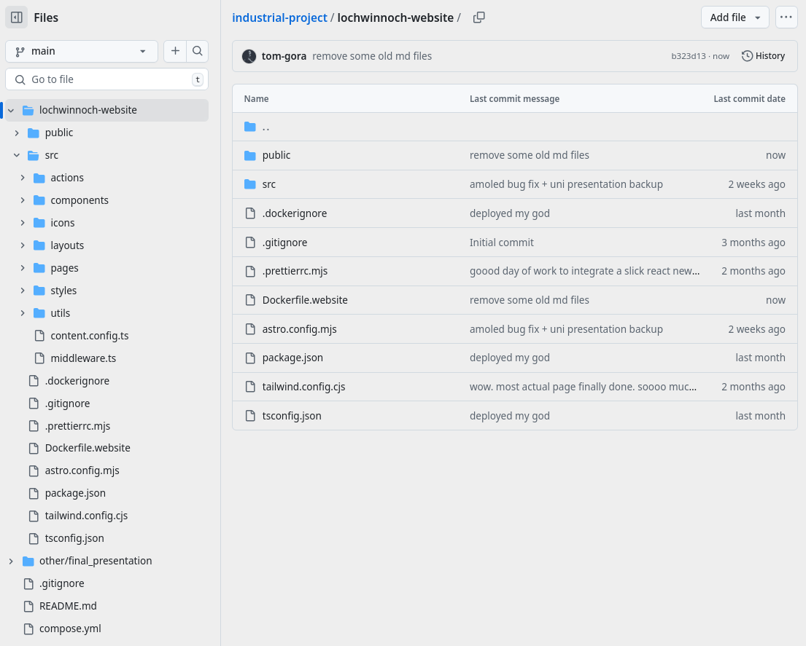

<frontpage></frontpage>

#### Industrial Project

  

## Reflective Journal

## TOM GORA

## B01665261

**Module:** WRKB10001 - WBL 4 – Industrial Project

**Year:** 2025  
**Term:** 1 and 2  
**Coordinator:** Tom Caira  
**Project Org:** Lochwinnoch Community Development Trust

---

#### Contacts

@ [TRUST'S WEBPAGE](https://lochwinnochtrust.org.uk/)  
@ [COORDINATOR'S LINKEDIN](https://uk.linkedin.com/in/tomcaira)  
@ [STUDENT'S PORTFOLIO](https://tomgora.online)

<spacer></spacer>
<pagebreak></pagebreak>
<spacer></spacer>

#### Table of Contents

    

        <a href="#project-overview">Project Overview</a>03
    

    

        <a href="#reflection-on-prior-academic-learning">Reflection on Prior Academic Learning</a>05
    

    

        <a href="#reflection-on-the-development-and-application-of-work-in-client-environment">Reflection on the Development and Application of Work in Client
            Environment</a>06
    

    

        <a href="#initial-planning-and-backend-selection-challenges">Initial Planning and Backend Selection Challenges</a>06
    

    

        <a href="#planning-and-deployment-challenges">Planning and Deployment Challenges</a>07
    

    

        <a href="#security-incident-and-learning">Security Incident and Learning</a>08
    

    

        <a href="#technical-integration-issues">Technical Integration Issues</a>09
    

    

        <a href="#reflection-on-personal-and-professional-development">Reflection on Personal and Professional Development</a>10
    

    

        <a href="#reflection-on-technical-and-learning-skills-achieved">Reflection on Technical and Learning Skills Achieved</a>11
    

    

        <a href="#technical-skills-development">Technical Skills Development</a>11
    

    

        <a href="#changed-perspectives-on-professional-practice">Changed Perspectives on Professional Practice</a>12
    

    

        <a href="#areas-for-further-development">Areas for Further Development</a>13
    

    

        <a href="#reflection-on-future-career">Reflection on Future Career</a>13
    

    

        <a href="#tangible-outcomes-and-portfolio-development">Tangible Outcomes and Portfolio Development</a>14
    

    

        <a href="#skill-alignment-with-industry-demands">Skill Alignment with Industry Demands</a>14
    

    

        <a href="#adaptability-and-breadth-of-skill-in-the-modern-market">Adaptability and Breadth of Skill in the Modern Market</a>14
    

    

        <a href="#solidifying-career-direction">Solidifying Career Direction</a>15
    

    

        <a href="#summary">Summary</a>16
    

    

        <a href="#client-feedback">Client Feedback</a>16
    

    

        <a href="#overall-professionalizm-discussion">Overall Professionalism Discussion</a>16
    

    

        <a href="#bibliography">Bibliography</a>16
    

    

        <a href="#appendices">Appendices</a>16
    

<spacer></spacer>
<pagebreak></pagebreak>
<spacer></spacer>

---

#### Project Overview

The industrial project undertaken focused on the complete redesign and development of a new website for the Lochwinnoch Community Development Trust (LCDT). LCDT is a non-profit organization established 12 years ago to build local community and realize various related projects in this village in the historic west central area of Scotland. With over 300 members, the project presented an ideal balance for an academic industrial placement—larger in scope and impact than a small sole trader website, yet still manageable for a student developer working independently.

This project presented a unique opportunity to work outside traditional corporate constraints. The relatively small scope afforded considerable freedom to explore, create, and learn while implementing modern web development practices. However, this freedom came paired with the significant responsibility of delivering a polished, professional product that could be effectively managed by organizational representatives with minimal technical knowledge. This balance between creative autonomy and practical implementation for non-technical end-users became a central consideration throughout the development process.

The previous LCDT website had several limitations that hindered its effectiveness as a community resource and organizational tool. An initial analysis revealed opportunities for improvement in terms of design, functionality, content management, and accessibility. The organization required a digital platform that would effectively represent its mission while enabling non-technical staff to maintain and update content independently.

<spacer></spacer>
<pagebreak></pagebreak>
<spacer></spacer>

Based on this analysis, the project objectives were defined as follows:

1. Design and develop a modern, visually appealing website that appropriately represented LCDT and its community activities
2. Implement a content management system (CMS) that non-technical staff could easily use to update content
3. Ensure high accessibility standards to serve the diverse community members
4. Create a cost-effective solution that would be sustainable for a small non-profit organization
5. Deliver a minimum viable product (MVP) with core functionality while allowing for future enhancements

The project was successfully completed with the delivery of a fully functional MVP website that met all the primary objectives. Key achievements include:

1. Development of a responsive website built using Astro as the frontend framework, chosen for its performance benefits and modern development capabilities
2. Implementation of Directus as a headless CMS, providing an intuitive interface for content editors with different permission levels
3. Creation of four theme variants, including high-contrast AMOLED options specifically designed for accessibility
4. Integration of various accessibility features including ARIA attributes, semantic HTML, skip navigation buttons, and adjustable font size and contrast settings
5. Deployment of the solution on a Virtual Private Server (VPS) using Docker, resulting in a cost-effective hosting arrangement at approximately £5 per month
6. Establishment of role-based access control, allowing administrators and editors different levels of system access appropriate to their responsibilities
7. Implementation of a streamlined content workflow where editors can create, edit, publish, and unpublish content with immediate frontend reflection

While some planned features such as comment functionality and tag-based organization were deferred to post-MVP development phases, the delivered website provides LCDT with a solid foundation that meets their immediate needs while allowing for future expansion and refinement based on user feedback and organizational requirements.

<spacer></spacer>
<pagebreak></pagebreak>
<spacer></spacer>

#### Reflection on Prior Academic Learning

My educational journey in software development began at college with fundamental programming concepts taught through Java console applications and introductory PHP websites. This was later expanded at university with additional exposure to more PHP echo statements plus Java in the form Android "Hello World", and _Microsoft Java_ in the form of C#. Joking aside, while these experiences established important foundational knowledge, the LCDT website project required a substantially different approach and technology stack that better aligned with current industry practices.

The transition from structured academic assignments to this real-world project highlighted both the benefits and limitations of traditional coursework. While university modules introduced important theoretical concepts around responsive design and accessibility standards, they often remained anchored to technologies and approaches that felt disconnected from contemporary development practices. This industrial project provided a refreshing opportunity to break free from curriculum constraints and explore more modern frameworks and methodologies that would deliver greater value to the client.

However, this project also revealed significant opportunities for growth beyond the academic curriculum. The decision to use Astro as a frontend framework and Directus as a headless CMS represented a deliberate departure from more conventional academic technologies like PHP-based content management systems. This choice stemmed from extensive self-directed learning in my personal time, where I've explored contemporary development tools including various JavaScript frameworks, Linux customization, and automated workflows that streamline development processes.

My self-initiated exploration of modern development ecosystems proved invaluable when confronted with the practical challenges of the LCDT project. The coursework-based understanding of software development lifecycles provided structure, but implementing a solution that prioritized both user accessibility and administrative simplicity required drawing on knowledge acquired through independent study and experimentation. This balance between academic foundations and self-directed learning ultimately enabled a more innovative approach than might have been possible following strictly academic methodologies.

<spacer></spacer>
<pagebreak></pagebreak>
<spacer></spacer>

The most significant realization during this project was recognizing that academic coursework often prioritizes conceptual understanding over practical implementation. While university assignments frequently focus on isolated technical problems with predetermined parameters, the LCDT website demanded consideration of competing priorities: technical excellence, client needs, user accessibility, and long-term maintainability. This holistic perspective required synthesizing knowledge across multiple domains rather than applying single concepts in isolation.

Perhaps most importantly, this industrial project provided space to apply my natural inclination toward problem-solving and technical exploration in a structured context with tangible deliverables. Where academic assignments sometimes felt disconnected from industry realities, this project offered a meaningful bridge to professional practice. The experience reinforced that while formal education establishes important fundamentals, the rapidly evolving nature of web development demands continuous self-education and adaptation beyond the curriculum—a reality that has shaped my approach to professional development and career planning moving forward.

#### Reflection on the Development and Application of Work in Client Environment

###### Initial planning and Backend Selection Challenges

A fundamental early decision involved determining the core technology stack, particularly concerning the Content Management System. Given the client's existing familiarity with WordPress, continuing with that platform was an initial consideration. However, the period during which these decisions were being made (late 2024) coincided with significant turbulence within the WordPress ecosystem. Widely publicised legal disputes involving major stakeholders, concerns regarding project governance, and debates about the platform's technical direction contributed to a prevailing sentiment of instability among segments of the developer community. Coupled with long-standing criticisms regarding WordPress's perceived architectural complexity, performance limitations for certain use cases, and the potential overhead associated with its plugin-heavy ecosystem, these factors prompted a careful re-evaluation.

<spacer></spacer>
<pagebreak></pagebreak>
<spacer></spacer>

Considering the project's goal to deliver a lean, modern, maintainable, and user-friendly solution for non-technical administrators, and viewing this industrial project as a key opportunity for exploring contemporary best practices, I decided against rebuilding within the WordPress framework.
Instead, I undertook research into alternative, self-hostable CMS solutions that might better align with the project's specific requirements. Several options were evaluated: TinaCMS was considered for its innovative live-editing capabilities directly on the rendered page, but its being a relatively new project, lack of documentation maturity, heavy React dependency destroying any simplicity of chosen framework (much more than selective "interactive islands approach of Astro"), and setup complexity were potential drawbacks. PayloadCMS offered significant flexibility and a "code-first" approach, appealing for customization, but appeared to require substantial configuration effort from a bare-bones base and seemed heavily oriented towards Next.js and automated deployments like Vercel, which were not part of this project's stack. Strapi, which I had prior experience with, was also evaluated, but its administrative interface, while powerful, felt potentially too technical in its abstraction of database concepts and vocabulary for the intended non-technical end-users at LCDT. Ultimately, Directus was selected. Its modern user interface, comprehensive out-of-the-box features (user roles, content modeling, API generation), and the perceived ease with which administrators could configure and manage content without deep technical intervention made it the most suitable choice for balancing developer flexibility with end-user simplicity for this specific project context.

###### Planning and Deployment Challenges

When starting this project, I promised to deploy a demo myself where client could check it out and play around with. This decision forced me to seriously learn Docker, understand images, containers and all the surrounding context as my previous knowledge was basic if not very limited. Before this, my approach in college was just placing static sites in a directory to serve, and for applications just running them via systemd service and telling Apache to proxy. I knew my existing server setup for portfolio where I would deploy the demo was a mess and not adequate, with setup done years ago when I was just blindly copying recipes from Stack Overflow to make things work while learning.

<spacer></spacer>
<pagebreak></pagebreak>
<spacer></spacer>

This need to improve deployments coincided with requirements from another module - Server Side Systems. I was having issues there because I could not deploy the old way. I developed at home on Fedora with PHP 8.3 while the server was on stable Debian with older incompatible version of PHP. I tried manual upgrading outside of package manager but made mess. I broke existing setup and ended with version conflicts, tried downgrading (which as I learned is something that is borderline impossible to do with PHP) and then literally killed my Apache setup by tweaking configs.

This is where I decided time to learn properly and all my public facing projects would benefit from this stepping up. I cmpletely deleted everything from the old days - Apache, broken PHP versions, messy directories in `/var/www/`, simply everything I had. I set up new organized structure in /srv/ with proper organization for apps, backend, sites and dedicated directory for industrial project demo.

To optimize rebuilding effort I chose Caddy, modern server written in Go which is great because it comes with automatic SSL cert setup, has config that is pleasant to write and simple (miles ahead of Apache), and excellent documentation. As I learned Docker properly I found package called `lazydocker` which is comprehensive TUI for managing docker, sparing me time exclusively using commands. I tidied everything and ultimately this sidequest gave me completely new robust portfolio where all projects are dockerized, securely exposed to localhost and sitting behind reverse proxy with fail2ban and ufw properly configured for security.

###### Security Incident and Learning

Big challenge that caused my significant concern was learning the important lesson to NOT expose Docker containers directly and put everything behind proxy and firewall. After deployment I noticed slowness but initially thought it was due to using the most affordable VPS option. This was not the case. After few weeks, an alert email from Linode prompted me to investigate. The server was operating at 100% CPU usage continuously due to a cryptominer infection.

<spacer></spacer>
<pagebreak></pagebreak>
<spacer></spacer>

I spent an entire weekend troubleshooting before understanding what was happening. The mining application was located in `/tmp` directory and masqueraded as a kernel worker process. I became quite alarmed when I observed "kworker" consuming all available resources. After terminating the process and removing related components, it would reappear within minutes, again utilizing 100% CPU. Online research suggested a possible rootkit infection requiring complete server replacement. When I discovered my personal computer also showed "kworker" processes, my concern intensified considerably.

The actual issue was that I had inadvertently left a PostgreSQL port exposed to the internet, thinking I would connect from a local GUI application. This was a critical mistake. With an open port, automated bots can quickly gain access, install mining software, and name it to resemble legitimate system processes. I removed the malicious software, but legitimate kworker processes appearing in the process list were actually normal system routines. I nearly proceeded with completely replacing the server – even purchasing a new virtual machine. Fortunately, I reconsidered, conducted proper research, and implemented appropriate server hardening measures. The server continued to receive numerous connection attempts for some time, but eventually these subsided as the automated botnet attempts timed out.

###### Technical Integration Issues

Another significant challenge that considerably impacted my progress for a week occurred when components that functioned correctly in development failed in production. On the server, the Directus container was unable to start the service, generating a `TypeError: fetch failed` error in the stack trace. I conducted extensive investigation following GitHub issues and research threads, configuring various container settings, and attempting different network configurations including Docker network, external network, and localhost, all without success. The solution eventually came through advice from community members on Directus' Discord support forum, who suggested running the container in host mode to force localhost communication without port mapping and Docker DNS. The underlying issue appears to be in the undici HTTP client for Node.js, as similar symptoms are documented in GitHub issues. For a small website behind a reverse proxy, utilizing host network mode was an acceptable compromise.

<spacer></spacer>
<pagebreak></pagebreak>
<spacer></spacer>

The final issue was more straightforward but somewhat embarrassing – I had not properly considered the implications of incorporating React for client-side rendering. During the initial presentation with the module coordinator, the application functioned correctly on my development machine where Directus was running locally. However, when the coordinator accessed the site through their browser, the client-side JavaScript attempted to connect to localhost on their machine where no endpoints existed. The solution required replacing localhost references with the actual domain in URL configurations. Fortunately, I had stored URLs in an `.env` file, requiring changes in only one location. This experience reinforced the importance of proper project configuration and demonstrated the value of centralized configuration through `.env` files and CSS variables as implementations of the single source of truth principle.

Despite these challenges, a structured approach to development and willingness to learn new technologies led to successful delivery of a functional, accessible website meeting LCDT's primary objectives. The journey reinforced that adaptability and continuous learning are essential qualities in software development projects.

#### Reflection on Personal and Professional Development

This industrial project significantly developed my professional capabilities and understanding of ethical practice in ways aligning with British Computer Society (BCS) Code of Conduct core principles.There are four of them listed on the official webpage of BCS:

The BCS principle "You make IT for everyone" directly informed my approach to accessibility. Rather than treating accessibility as an optional enhancement, I implemented high-contrast themes, semantic HTML, ARIA attributes, and adjustable display settings as core requirements. This commitment to inclusive design reflects the professional responsibility to ensure technology serves diverse user needs.

"Show what you know, learn what you don't" became particularly relevant when confronting deployment challenges. Recognizing my limited Docker experience, I deliberately chose to expand my capabilities rather than relying on familiar but less optimal solutions. This principle guided my response to the security incident as well - rather than resorting to a complete server replacement, I invested time in properly understanding the root cause and implementing appropriate security measures.

<spacer></spacer>
<pagebreak></pagebreak>
<spacer></spacer>

The principle "Respect the organisation or individual you work for" manifested in my collaborative approach with LCDT. By maintaining transparent communication about technical challenges and ensuring the final product aligned with their specific organizational needs, I demonstrated respect for their mission and requirements.

"Keep IT real. Keep IT professional. Pass IT on" influenced my approach to security hardening following the cryptominer incident. This experience reinforced that professional integrity involves not only addressing immediate issues but also preventing deployed systems from becoming vectors for malicious activity that could impact others. The lessons learned during this project - particularly regarding deployment security and configuration management - represent valuable knowledge I can apply to future projects and share with colleagues.

#### Reflection on Technical and Learning Skills Achieved

This industrial project significantly expanded my technical capabilities across multiple domains while providing valuable insights into areas for future development. The experience transformed my understanding of modern deployment practices and reinforced the importance of security, configuration management, and systems integration.

###### Technical Skills Development

The most substantial technical growth occurred in containerization and deployment automation. Prior to this project, my deployment experience was limited to conventional approaches using direct file placement and server configuration. Implementing Docker containerization required developing an entirely new skill set, including understanding container lifecycles, networking, volume management, and orchestration.

This expansion of capabilities extended beyond the immediate project requirements, creating valuable transferable skills applicable across diverse technology stacks. I applied these newly acquired skills to containerize various applications including Laravel, PHP, React, multiple CMS systems, and even Spring Boot projects as I migrated my previous work to the new infrastructure.

<spacer></spacer>
<pagebreak></pagebreak>
<spacer></spacer>

Server security represented another area of significant technical development. The cryptomining incident provided practical experience in threat detection, system hardening, and security best practices. Learning to implement and configure tools like `fail2ban` and UFW (Uncomplicated Firewall) established essential skills for responsible systems administration. This experience transformed my approach to deployment security from reactive to proactive, emphasizing preventative measures rather than incident response.

Integration challenges between Astro and Directus developed technical problem-solving skills, particularly in diagnosing complex system interactions. The experience reinforced the importance of understanding network topologies in containerized environments and the distinctions between different communication methods (Docker networks, host networking, port mapping). This knowledge proved especially valuable when troubleshooting production environment issues that did not manifest during development.

###### Changed Perspectives on Professional Practice

This project fundamentally altered my perception of configuration management and environment variables. Previously, I had primarily used `.env` files exclusively for storing sensitive information like credentials. The experience of managing environment-specific configuration demonstrated the broader utility of centralized configuration beyond merely protecting sensitive information. This represents a significant evolution in my understanding of software architecture best practices.

Similarly, the deployment security incident transformed my approach to system exposure and the principle of least privilege. The experience reinforced that proper security is not merely about responding to known threats but about minimizing attack surfaces through deliberate access restrictions. This represents a shift from a feature-centric development mindset to one that incorporates security considerations throughout the development lifecycle.

<spacer></spacer>
<pagebreak></pagebreak>
<spacer></spacer>

###### Areas for Further Development

While the project substantially expanded my technical capabilities, it also highlighted several areas for continued professional development:

1. **Container Orchestration**: While I successfully implemented basic containerization, more complex orchestration tools like Kubernetes remain an area for future exploration, particularly for larger deployments requiring automated scaling and high availability.

2. **Automated Testing**: The URL configuration issue that emerged during demonstration might have been detected earlier with more comprehensive testing practices, suggesting an opportunity to develop stronger automated testing skills.

3. **Infrastructure as Code**: Although the deployment environment was successfully established, the process relied partially on manual configuration. Implementing infrastructure as code approaches would enhance reproducibility and disaster recovery capabilities.

4. **Frontend Performance Optimization**: While accessibility features were successfully implemented, further optimization of client-side performance would enhance user experience, particularly for users with lower-bandwidth connections.

This industrial project ultimately transformed my self-perception from a primarily development-focused practitioner to a more holistic technologist capable of addressing the complete application lifecycle from requirements through secure deployment and maintenance. This broader perspective has significant implications for future professional opportunities and specialization directions.

#### Reflection on Future Career

This industrial project has provided not only significant technical learning but also valuable clarity regarding future career aspirations and professional positioning within the software development landscape. The practical experience gained, particularly in navigating the full project lifecycle from requirements gathering through to deployment and security hardening, has substantially shaped my perspective on desirable roles and necessary skill sets in the current industry.

<spacer></spacer>
<pagebreak></pagebreak>
<spacer></spacer>

###### Tangible Outcomes and Portfolio Development

The primary tangible outcome, the redesigned website for the LLL Community Development Trust, serves as a concrete demonstration of applied skills. There exists potential to continue collaboration with the client beyond the scope of this academic module, further developing the platform based on their evolving needs. Should this not materialise, the project itself provides a robust, real-world example suitable for rebranding and inclusion in my professional portfolio. In today's competitive job market, presenting such a comprehensive project – encompassing modern frontend development with Astro, headless CMS integration using Directus, containerized deployment via Docker, and security considerations – is significantly more impactful than theoretical exercises or smaller code snippets. It showcases the ability to deliver a complete, functional product.

###### Skill Alignment with Industry Demands

The specific technical challenges encountered during this project directly fostered skills highly relevant to contemporary industry demands. The deep dive into Docker for containerization and Caddy for modern web serving and proxying, necessitated by the deployment requirements and issues with older methods, provided practical DevOps experience. Similarly, confronting and resolving the server security incident offered invaluable, albeit stressful, lessons in system hardening, firewall configuration (ufw, fail2ban), and the critical importance of secure deployment practices – skills often sought after in roles beyond pure development. The focus on accessibility throughout the design and implementation phase also aligns with the growing industry emphasis on inclusive design and regulatory compliance.

###### Adaptability and Breadth of Skill in the Modern Market

Undertaking this project as the sole developer required a breadth of involvement across various domains – requirements analysis, technology selection, frontend design (adapting a theme), backend integration (CMS), deployment, and security. This experience underscored the value of adaptability and a holistic understanding of the development process. In an era where AI tools are increasingly capable of handling routine coding tasks, the ability to learn quickly, integrate diverse technologies, troubleshoot complex issues (like the undici bug or the localhost configuration error), and manage the entire lifecycle becomes a key differentiator.

<spacer></spacer>
<pagebreak></pagebreak>
<spacer></spacer>

This project provides strong evidence of that adaptability and a willingness to tackle challenges across the stack, positioning me not just as a coder in one niche, but as a versatile developer capable of contributing more broadly, which I believe is increasingly necessary for career longevity and success.

###### Solidifying Career Direction

While this project provided a valuable opportunity to engage with a modern technology stack (Astro, exploring CMS options on the market) and contemporary practices like containerization, it is understood that professional software development frequently involves navigating different realities. Much industry work centres on maintaining legacy codebases, integrating with existing systems, operating within corporate constraints, or competing with established solutions like WordPress templates. This industrial project, therefore, stands out not necessarily as a direct template for all future work, but as a significant opportunity within the academic framework to freely explore technologies beyond the standard curriculum. Successfully delivering the project under these conditions demonstrated a crucial capacity for self-directed learning, adaptability in choosing and integrating appropriate tools for the job (like selecting to use and learn Caddy for simplicity that involved some learning but produced lean and configurable setup to save time in the end), and resilience in overcoming unforeseen technical challenges. These are transferable professional attributes valuable irrespective of the specific technological environment encountered in future roles, showcasing an open-minded approach and a readiness to learn and adapt – qualities essential for navigating the complexities of real-world software engineering.

<spacer></spacer>
<pagebreak></pagebreak>
<spacer></spacer>

#### Summary

This reflective journal detailed a range of experiences from initial project planning through final deployment. Several key moments and challenges significantly shaped both the final product and my personal growth. The development journey of the LLL Community Development Trust (LCDT) website emphasized careful planning, security and importance of learning new concepts. Overall that made an interesting and impactful course.

A core element that requires analysis is feedback from the client at the time of submission.

###### Client Feedback Analysis

The LCDT provided several points about the final result. First, there needs to be some cleaning in design to enhance user engagement. Currently design and usability feels basic as the minimalistic look requires improvement and in general breaking blocks of text will improve readability as it can feel too large. There are suggestions of standardising font sizes and headers to create cohesive look and enhancing engaging visuals. They stated need to work on improving content as key objectives for supporting trust need to be more prominent and to simplify navigation journey for finding support. Website need more obvious cues for contact submissions and other common questions to improve user engagement. With better description implemented website can provide clear and more easy understanding about objectives. There also seems to be some need for improvements in meta descriptions to improve search visibility. Some elements of the website do have good contrast but it is important to improve it. Finally there is some need for clearity with action cues as they are currently understated, and that privacy policy should also be standardised and more transparent. For them transition with more user friendly CMS will be useful.

These critiques can be interpreted with a mix of reactions both validating the effort done and showing potential for new improvements in future versioning, while it can be looked for in both ways they are at the time for me extremely useful points for understanding the product by those to whom it is dedicated and their needs. This has highlighted important communication considerations in project and requirements gathering to make a client engaged in active way to provide more information.

<spacer></spacer>
<pagebreak></pagebreak>
<spacer></spacer>

###### Overall Professionalism Discussion

These problems that occurred highlight the importance of clear communication. While the end outcome was successfull, there has been times while working on the project on client's lack of feedback I found in many ways myself unsure what course to take. If these problems are there it is extremely likely to see them again.

I understand this is often caused by external circumstances like this in this case, I need to understand that time management and engagement often is hard task to enforce in certain external context, my goal is in the future to create some strategy to work in those situations even with smaller or non-existent timeframe and with almost 0 external inputs, as at that point my professional qualities, knowledge and experience has to shine.

I approached development and deployment with consistent effort to meet the project goals in the specified time frame, which while hard I consider as a skill to try to push and improve whenever the change happens. If I plan on making this the focus of my job search from here, these points can serve as basis for personal roadmap. I also need to make sure that I keep improving my communications in every direction, as again, the skill matters. This requires further engagement with industry and to better structure the time, focus and to look for assistance whenever required.

Even with several challenges that were present the project succeeded for two reasons, that on planning step all main project goals have had clear expectations how they are made and that willingness to solve new problems I had for the entire journey. That makes clear and measurable what it is supposed to be achieved and solve at those constraints but at the same time do the thing for real and not just repeat recipes. In future it will require more communication with team and customer and better understanding of the domain. There can be new interesting areas of software industry to consider moving forward.

This experience reinforced how professional competence directly links to public interest and well-being. With that mindset and the lessons extracted this far, this project has laid a strong foundation for my future professional and personal development.

<spacer></spacer>
<pagebreak></pagebreak>
<spacer></spacer>

#### Bibliography

Astro. (2025). Dante | Astro. [online] Available at: https://astro.build/themes/details/dante/ [Accessed 2 Apr. 2025].

Docs. (2025). Getting started. [online] Available at: https://docs.astro.build/en/getting-started/ [Accessed 2 Apr. 2025].

Youtube.com. (2025). Available at: https://www.youtube.com/watch?v=XoIHKO6AkoM [Accessed 2 Apr. 2025].

Docs. (2025). On-demand rendering. [online] Available at: https://docs.astro.build/en/guides/on-demand-rendering/ [Accessed 2 Apr. 2025].

Docs. (2025). @astrojs/react. [online] Available at: https://docs.astro.build/en/guides/integrations-guide/react/ [Accessed 2 Apr. 2025].

Docs. (2025). @astrojs/node. [online] Available at: https://docs.astro.build/en/guides/integrations-guide/node/ [Accessed 2 Apr. 2025].

Docs. (2025). Build your Astro site with Docker. [online] Available at: https://docs.astro.build/en/recipes/docker/ [Accessed 2 Apr. 2025].

Directus Docs. (2025). Fetch Data From Directus with Astro | Directus Docs. [online] Available at: https://directus.io/docs/tutorials/getting-started/fetch-data-from-directus-with-astro [Accessed 2 Apr. 2025].

Directus Docs. (2025). Overview | Directus Docs. [online] Available at: https://docs.directus.io/self-hosted/docker-guide.html [Accessed 2 Apr. 2025].

Docker.com. (2025). Available at: https://hub.docker.com/r/directus/directus [Accessed 2 Apr. 2025].

Matheson, B. (2021). How to Permanently Kill and Remove kdevtmpfsi or kinsing - brycematheson.io. [online] brycematheson.io. Available at: https://brycematheson.io/how-to-permanently-kill-and-remove-kdevtmpfsi-kinsing/ [Accessed 2 Apr. 2025].

docker-library (2021). kdevtmpfsi virus use 99% of cpu · Issue #1127 · docker-library/php. [online] GitHub. Available at: https://github.com/docker-library/php/issues/1127 [Accessed 2 Apr. 2025].

nodejs (2023). TypeError: fetch failed · Issue #1248 · nodejs/undici. [online] GitHub. Available at: https://github.com/nodejs/undici/issues/1248 [Accessed 2 Apr. 2025].

nodejs (2024). fetch times out in under 5 seconds · Issue #1531 · nodejs/undici. [online] GitHub. Available at: https://github.com/nodejs/undici/issues/1531 [Accessed 2 Apr. 2025].

<spacer></spacer>
<pagebreak></pagebreak>
<spacer></spacer>

#### Appendices

###### Appendix 1
[source code]

[GITHUB LINK](https://github.com/tom-gora/industrial-project)
 
 
 
 

 
 
 
 
###### Appendix 2
[critique feedback from the client]
